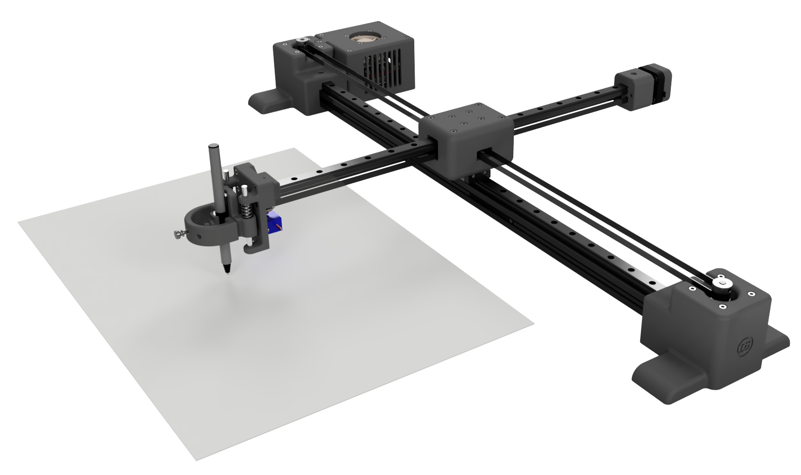

## Plotyx - Open-source XY plotter
Plotyx is an open-source XY pen plotter, built using a mix of 3D printed and off-the-shelf parts. It focus on using linear rails for precise movement and accuracy, and provides a working area of just over A3 paper size.  
 

